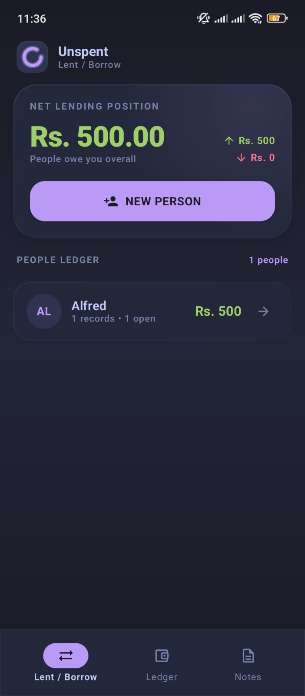
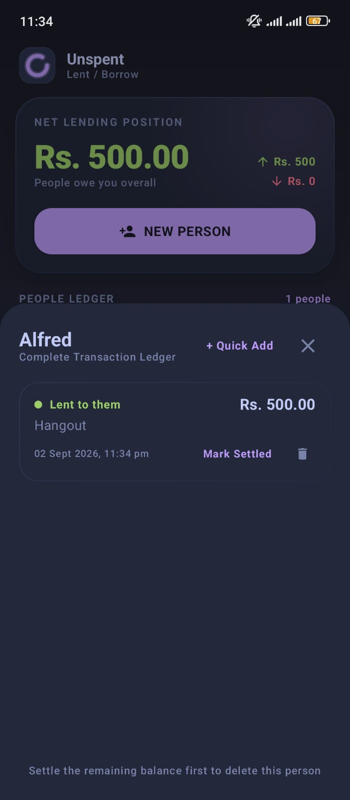
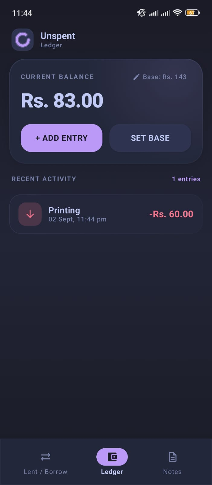
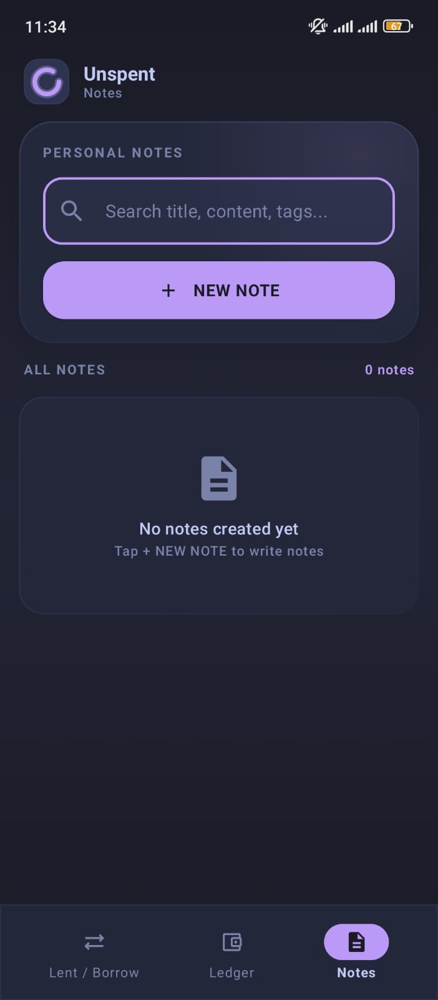
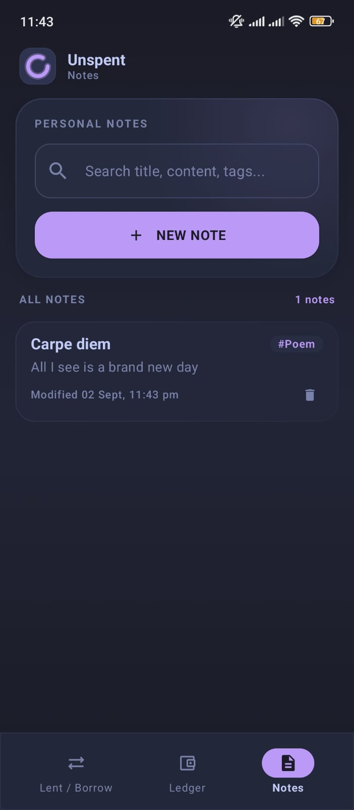
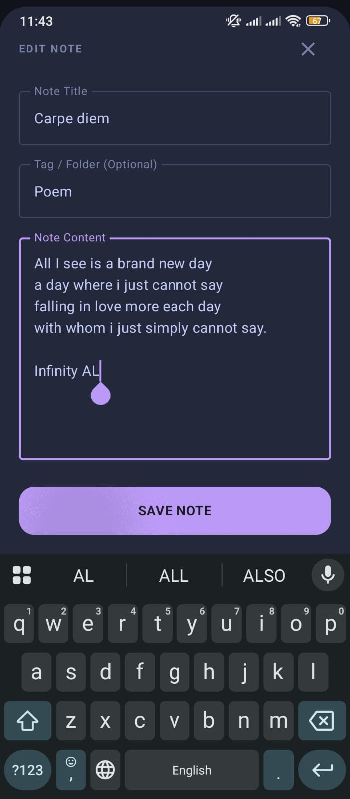

<div align="center">
<h1>🪙 Unspent</h1>
<p><em>A 100% local personal finance tracker — lending, balances & notes. No cloud, no account, no tracking.</em></p>
</div>

---

## ✨ Features

Unspent bundles three independent personal-finance tools into a single, offline-first Android app:

### 💰 Personal Balance Ledger
- Track income (+) and expenses (−) with custom labels
- View your current running balance in real time
- Set a base/starting balance
- Color-coded entries: green for income, red for expenses

### 🤝 Lending & Borrowing Tracker
- Maintain a people ledger — create contacts for anyone you lend to or borrow from
- Record transactions per person (lent / borrowed)
- Quick-add sheet with zero typing for existing contacts
- Real-time duplicate detection with suggestion chips
- Full per-person transaction history with **partial or full settlement**
- Net position dashboard: total owed to you (green) vs. total you owe (red)
- Delete a person only after all their entries are settled

### 📝 Simple Notes
- Create/edit plain-text notes with optional tags
- Full-text search across title and content
- Markdown stripped automatically on save (plain-text focused)
- Sorted by most recently modified

---

## 📸 Screenshots

<div align="center">
  
  
  
  
  
  
</div>

---

## 🛠 Tech Stack

| Layer     | Technology                                             |
|-----------|--------------------------------------------------------|
| Language  | [Kotlin](https://kotlinlang.org/) 2.2                    |
| UI        | [Jetpack Compose](https://developer.android.com/jetpack/compose) + Material 3 |
| Persistence | [Room](https://developer.android.com/training/data-storage/room) (local SQLite) |
| Async     | Kotlin Coroutines + Flow                                |
| DI        | None (manual constructor injection)                     |
| Networking| Retrofit + Moshi (declared, currently unused)           |
| Testing   | JUnit, Robolectric, Roborazzi (screenshot), Espresso    |
| Min SDK   | 24 · Target SDK 36 · Gradle 9.3.1                       |

> 🔒 **Privacy-first:** No `INTERNET` permission is declared in the manifest. All data stays on-device.

---

## 🏗 Architecture

**MVVM (Model-View-ViewModel)** — a single-activity, single-ViewModel architecture:

```
┌─────────────┐   StateFlow    ┌──────────────────┐
│  Compose UI │ ◄────────────► │  MainViewModel   │
│  (Screens)  │                │  (AndroidViewModel)│
└─────────────┘                └────────┬─────────┘
                                        │ viewModelScope
                              ┌─────────▼─────────┐
                              │   AppRepository    │
                              └─────────┬─────────┘
                                        │
                              ┌─────────▼─────────┐
                              │  Room Database     │
                              │  (5 tables / DAOs) │
                              └───────────────────┘
```

- **Model:** Room entities + DAOs + `AppRepository`
- **ViewModel:** `MainViewModel` exposes reactive `StateFlow`s that all screens collect via `collectAsStateWithLifecycle()`
- **View:** Pure Jetpack Compose — **zero XML layouts**
- Tab navigation is state-driven (`Crossfade`), not Navigation-Compose

---

## 📁 Project Structure

```
unspent/
├── app/
│   ├── src/
│   │   ├── main/
│   │   │   ├── java/com/example/
│   │   │   │   ├── MainActivity.kt            # Entry point + tab scaffold
│   │   │   │   ├── ui/
│   │   │   │   │   ├── MainViewModel.kt       # Single central ViewModel
│   │   │   │   │   ├── ledger/LedgerScreen.kt
│   │   │   │   │   ├── lending/LendingScreen.kt
│   │   │   │   │   ├── notes/NotesScreen.kt
│   │   │   │   │   ├── components/FrostedGlass.kt  # Design system
│   │   │   │   │   └── theme/                # Tokyo Night theme
│   │   │   │   ├── data/
│   │   │   │   │   ├── db/                   # Room DB + 5 DAOs
│   │   │   │   │   ├── model/                # Room entities
│   │   │   │   │   └── repository/AppRepository.kt
│   │   │   │   └── util/                     # Currency + Markdown utils
│   │   │   ├── res/                          # Compose theme + launcher icons
│   │   │   └── AndroidManifest.xml
│   │   ├── test/                             # Unit + Robolectric + Roborazzi
│   │   └── androidTest/                      # Instrumented tests
│   ├── build.gradle.kts
│   └── proguard-rules.pro
├── gradle/
│   ├── libs.versions.toml                    # Version catalog
│   └── wrapper/
├── build.gradle.kts
├── settings.gradle.kts
├── gradle.properties
└── .env.example
```

---

## 🚀 Getting Started

### Prerequisites

- [Android Studio](https://developer.android.com/studio) (latest stable)
- JDK 11+

### 1. Clone & open

```bash
git clone https://github.com/<your-username>/Unspent.git
```

Open the `Unspent` directory in Android Studio and let it sync the Gradle project.

### 2. Configure the API key (optional)

The project currently ships with a Gemini API capability stub. To enable the **Gemini API**, create a `.env` file in the project root with:

```
GEMINI_API_KEY=your_gemini_api_key_here
```

> If you don't need the Gemini feature, leave the `.env` unset — the app runs fully offline regardless.

### 3. Release signing setup (only if building a signed release)

Set the following environment variables before building a release APK:

```bash
export KEYSTORE_PATH=/path/to/upload-keystore.jks
export STORE_PASSWORD=your_store_password
export KEY_PASSWORD=your_key_password
```

The `release` build type references keyAlias `upload`. For local debug builds no signing config is required.

### 4. Run

Select the `app` run configuration and press **Run ▶** on an emulator or physical device (min SDK 24 / Android 7.0+).

---

## 🛠 Building

```bash
# Debug APK
./gradlew assembleDebug          # → app/build/outputs/apk/debug/

# Release APK (requires signing env vars above)
./gradlew assembleRelease        # → app/build/outputs/apk/release/

# Run unit tests
./gradlew test

# Run instrumented tests (device/emulator required)
./gradlew connectedAndroidTest

# Clean
./gradlew clean
```

---

## 🧪 Testing

- **Unit tests** — currency formatting, plus Robolectric context/string tests
- **Screenshot tests** — Roborazzi golden-image capture
- **Instrumented tests** — app-context validation on device

```bash
./gradlew testDebugUnitTest
```

---

## 📦 Releases

APK archives are maintained under `apk/` for offline distribution (not committed to source control). For a public release channel, we recommend attaching APKs to [GitHub Releases](https://docs.github.com/en/repositories/releasing-projects-on-github/managing-releases-in-a-github-repository) instead.

---

## 🔮 Roadmap / Ideas

See [Progress.md](Progress.md) for a full history and planned future work.

---

## 📄 License

This project is licensed under the [MIT License](LICENSE).

```
MIT License

Copyright (c) 2026 Unspent

Permission is hereby granted, free of charge, to any person obtaining a copy
of this software and associated documentation files (the "Software"), to deal
in the Software without restriction, including without limitation the rights
to use, copy, modify, merge, publish, distribute, sublicense, and/or sell
copies of the Software, and to permit persons to whom the Software is
furnished to do so, subject to the following conditions:

The above copyright notice and this permission notice shall be included in all
copies or substantial portions of the Software.

THE SOFTWARE IS PROVIDED "AS IS", WITHOUT WARRANTY OF ANY KIND, EXPRESS OR
IMPLIED, INCLUDING BUT NOT LIMITED TO THE WARRANTIES OF MERCHANTABILITY,
FITNESS FOR A PARTICULAR PURPOSE AND NONINFRINGEMENT. IN NO EVENT SHALL THE
AUTHORS OR COPYRIGHT HOLDERS BE LIABLE FOR ANY CLAIM, DAMAGES OR OTHER
LIABILITY, WHETHER IN AN ACTION OF CONTRACT, TORT OR OTHERWISE, ARISING FROM,
OUT OF OR IN CONNECTION WITH THE SOFTWARE OR THE USE OR OTHER DEALINGS IN THE
SOFTWARE.
```
